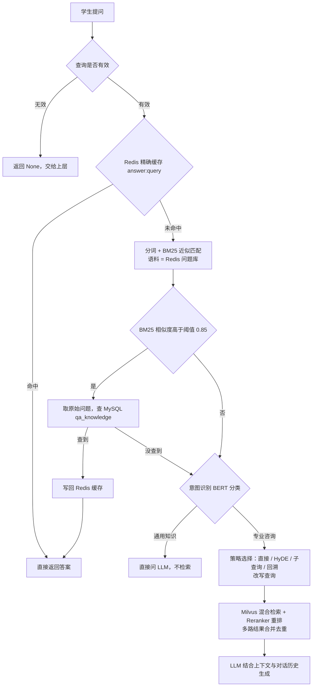

# XX 大学迎新问答助手（xx_school_rag）

面向大一新生的智能问答系统：融合 **BM25 关键词快速通道**、**意图识别分流**、
**Milvus 向量检索（BGE-M3 混合检索 + BGE-Reranker 重排 + 查询改写策略）** 和
**大模型生成（DeepSeek）**，支持多轮对话。

---

## 处理流程



## 目录结构

```
xx_shcool_rag/
├── base/                     配置 / 日志
│   ├── config.py             读取 config.ini + .env
│   └── logger.py
├── core/
│   ├── bm25_matcher.py       jieba(领域词典/停用词) + BM25 + 追加文档法归一化
│   ├── bm25_search.py        快速通道：Redis 缓存 + BM25 + MySQL 取答案
│   ├── query_classifier.py   意图识别 BERT 分类器（训练 + 推理）
│   ├── vector_store.py       Milvus 建库 / 灌向量 / 混合检索 + 重排
│   ├── strategy_selector.py  检索策略选择（直接/HyDE/子查询/回溯问题）
│   ├── prompts.py            Prompt 模板
│   ├── llm_client.py         DeepSeek（兼容 OpenAI 接口）
│   ├── mysql_client.py       qa_knowledge / conversations 读写
│   ├── redis_client.py       缓存 + 问题库
│   └── rag_system.py         主流程编排
├── utils/
│   ├── document_processor.py 文档加载 + 父子分块
│   ├── edu_document_loaders/ txt/md/pdf/docx/ppt/图片 加载器
│   └── edu_text_spliter/     中文递归切分器
├── scripts/
│   ├── gen_intent_dataset.py 生成意图分类训练集
│   └── init_milvus.py        建库 + 灌文档向量
├── data/
│   ├── mysql_data/new_student_qa.csv   30 条迎新问答（GBK）
│   ├── rag_data/<分类>_data/           RAG 长文档（按分类分目录）
│   ├── train_data/classify_data/       意图分类训练集
│   ├── stopwords.txt / user_dict.txt   BM25 分词资源
├── models/                   本地模型（不入库，见 models/README.md）
├── static/                   Web 前端
├── app.py                    FastAPI + WebSocket 流式服务
├── main.py                   命令行入口
├── config.ini / .env         配置 / 密钥
```

## 环境准备

**1. Python 3.10 + 依赖**

```bash
pip install -r requirements.txt
```

**2. 本地模型**：见 [`models/README.md`](models/README.md)（bge-m3 / bge-reranker-large /
bert-base-chinese；意图分类器可本地训练）。

**3. 中间件**（示例用 Docker）：

| 服务 | 版本 | 端口 |
|---|---|---|
| MySQL | 8.0 | 3306 |
| Redis | 7+ | 6379 |
| Milvus | 2.4.x（standalone） | 19530 |

> 若本机设了 HTTP 代理，`vector_store.py` 会自动把 Milvus 主机加入 `no_proxy`，
> 避免 gRPC 连接被代理拦截。

**4. 配置**：改 `config.ini`（数据库地址、Milvus 集合名、BM25 阈值、分类等），
`.env` 放 `DEEPSEEK_API_KEY`。

## 数据初始化

```bash
# ① MySQL：建表 + 导入 30 条问答
python -m core.mysql_client

# ② 意图分类器：生成训练集 + 训练（产出 models/bert_query_classifier/）
python scripts/gen_intent_dataset.py --llm
python -m core.query_classifier

# ③ Milvus：建库 + 把 data/rag_data/ 下文档灌入向量库
python scripts/init_milvus.py
```

> Redis 的 BM25 问题库在首次运行时自动从 MySQL 构建。

## 运行

**命令行：**
```bash
python main.py
```

**Web 服务：**
```bash
pip install fastapi websockets
python app.py            # 默认 http://0.0.0.0:8080
```

## 关键配置项（config.ini）

| 段 | 项 | 说明 |
|---|---|---|
| `[mysql]` `[redis]` `[milvus]` | host/port/... | 中间件连接 |
| `[milvus]` | `collection_name` | 向量集合名 |
| `[bm25]` | `threshold` | 快速通道相似度阈值（默认 0.85） |
| `[retrieval]` | `retrieval_k` / `candidate_m` / `*_chunk_size` | 检索条数、父子分块大小 |
| `[app]` | `valid_sources` | 分类列表（= RAG 文档目录名） |
| `[llm]` | `model` / `base_url` | DeepSeek 模型与地址 |

## 已知事项

- 专业咨询走 RAG 前会先让 LLM 选检索策略并改写查询，每次多一次 LLM 请求；
  策略提示词与合并上限见 `core/strategy_selector.py` / `core/rag_system.py`。
- `conversations.timestamp` 使用 MySQL 服务端时区。
- 意图分类训练集为模板 + LLM 增广生成，边界样本（泛化大学问题）偏向「通用知识」。
- `models/` 约 6 GB，不纳入 Git；`.env` 含密钥，已在 `.gitignore`。
